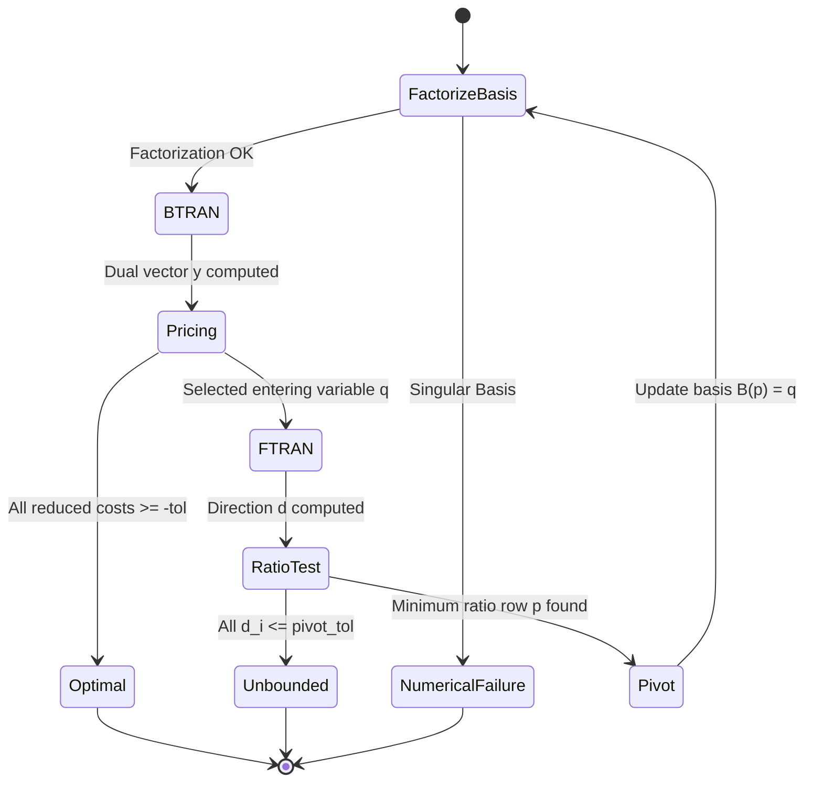

# Phase 3: LP Solver Core — Authoritative Mathematical & Engineering Specification

**Document Version:** 1.0.0  
**Status:** DRAFT SPECIFICATION (Phase 3 Gate)  
**Authoritative Baseline Commit:** `7bfa19a097b674d83ca79ce3886c1ed36db9eb33`  
**Repository:** `SIH26119-Indigenous-GPU-Accelerated-Optimization-Solver`  

---

## 1. Executive Summary & Scope

### 1.1 Objective
Phase 3 establishes the native Linear Programming (LP) solver core for the SIH26119 Optimization Solver. The solver operates on the canonical continuous optimization model established in Phase 1 and utilizes the sparse numerical linear algebra foundations frozen in Phase 2.

The solver development follows an exact progression:
$$\text{LP Mathematical Standardization} \longrightarrow \text{Basis Representation} \longrightarrow \text{Revised Simplex Core} \longrightarrow \text{Primal Simplex} \longrightarrow \text{Dual Simplex} \longrightarrow \text{Independent LP Solution Verification}$$

### 1.2 Strict Scope Boundaries
1. **In-Scope (Phase 3 Core)**:
   - Canonical LP model inspection and lossless mathematical standardization.
   - Deterministic standard-form translation ($\min c^T x$ s.t. $A x = b, x \ge 0$).
   - Basis state representation, column indexing, and nonbasic variable partitions.
   - First-principles mathematical derivation of the revised simplex algorithm under a unified minimization convention.
   - Deterministic Primal Simplex with Bland's anti-cycling rule.
   - Two-Phase simplex method (Phase I auxiliary feasibility and Phase II optimality).
   - Dual Simplex mathematical specification.
   - Zero-heap-allocation numerical linear algebra integration via caller-owned workspaces.
   - Basis factorization interface (abstracting direct triangular solve $B x = b$ and $B^T y = c$).
   - Explicit separation of numerical tolerances (feasibility, optimality, pivot, singularity).
   - LP solution contract and independent mathematical verifier.
   - Independent vertex enumeration oracle for small-scale verification.
   - Deterministic test matrix.

2. **Out-of-Scope (Forbidden in Phase 3)**:
   - Implementation of Interior Point Methods (IPM) or Primal-Dual Hybrid Gradient (PDHG).
   - Quadratic Programming (QP) and Mixed-Integer Linear Programming (MILP) branch-and-bound/cut algorithms.
   - General presolve reductions (dual postsolve, probing, clique tables).
   - GPU/CUDA execution kernels (Phase 3 is CPU-only).
   - Integration of or reliance on external third-party solvers (Gurobi, CPLEX, HiGHS, SCIP, COIN-OR, GLPK, OR-Tools).

---

## 2. Repository Architecture & Subsystem Reuse Inventory

### 2.1 Reusable Phase 1 & Phase 2 Subsystems
The Phase 3 LP specification directly builds on existing, frozen abstractions:

1. **Canonical Model Representation (`src/model/`)**:
   - `Model` ([`src/model/model.hpp`](file:///c:/Users/mohit/OneDrive/Desktop/SIH26119%20%E2%80%94%20Indigenous%20GPU-Accelerated%20Optimization%20Solver/src/model/model.hpp)): Provides the immutable problem definition: variables, bounds $[l_j, u_j]$, linear constraints $[L_i, U_i]$, objective sense $\min / \max$, linear coefficients $c_j$, and constant scalar offset $c_0$.
   - `Variable` & `Constraint`: Rich bound queries (`is_equality()`, `is_less_equal()`, `is_greater_equal()`, `is_range()`, `is_free()`, `is_fixed()`).
   - Types ([`src/model/types.hpp`](file:///c:/Users/mohit/OneDrive/Desktop/SIH26119%20%E2%80%94%20Indigenous%20GPU-Accelerated%20Optimization%20Solver/src/model/types.hpp)): `VariableIndex` (`uint32_t`), `ConstraintIndex` (`uint32_t`), `DimensionCount` (`uint32_t`), `NonzeroCount` (`uint64_t`).

2. **Core Error & Result System (`src/core/`)**:
   - `Status` & `Result<T>`: Strict, checked error handling with `StatusCode` (`Ok`, `InvalidArgument`, `NumericalFailure`, etc.). No unhandled exceptions or unchecked raw pointers.

3. **Sparse & Dense Numerical Foundations (`src/numerics/`)**:
   - `Scalar`: `double` (IEEE 754 double precision).
   - `DenseVector`: Contiguous real array with bounds checking, zero-overhead raw pointer access, AXPY, dot product, and scaled norm accumulation.
   - `DenseMatrix`: Contiguous column-major storage ($A_{i,j} = \text{data}[i + j \cdot m]$).
   - `SparseMatrix`: Canonical Compressed Sparse Row (CSR) matrix with sorted column indices, structural zero elimination, SpMV ($y = Ax$), and residual ($r = b - Ax$).
   - `Tolerance` & `approx_equal`: Baseline semantic comparison tolerances ($\text{abs\_tol} = 10^{-12}, \text{rel\_tol} = 10^{-12}$).
   - **Hot-Path Workspace Contract**: Three-argument methods `multiply(x, y, scratch)` and `residual(b, x, r, scratch)` providing guaranteed zero dynamic heap allocations and strict transactional rollback on overflow.

### 2.2 What Phase 3 Must Introduce
1. `src/solver/lp/lp_standard_form.hpp / .cpp`: Standardization engine mapping canonical Phase 1 `Model` to standard equality form.
2. `src/solver/lp/basis_state.hpp / .cpp`: Representation of basis/nonbasic partitions and status flags.
3. `src/solver/lp/basis_factorization.hpp`: Abstract numerical interface for solving $B x = b$ and $B^T y = c$.
4. `src/solver/lp/revised_simplex.hpp / .cpp`: Revised simplex state machine, FTRAN, BTRAN, pricing, and ratio test.
5. `src/solver/lp/lp_solution.hpp`: Solution data transfer object.
6. `src/solver/lp/lp_verifier.hpp / .cpp`: Independent mathematical certificate and residual verification.

### 2.3 Subsystem Invariants & Explicit Assumptions
- **Allowed Assumptions**:
  - The input `Model` passes `model.validate()` and `model.is_lp()` returns `true`.
  - All original variables in an LP instance are continuous (`VariableType::Continuous`).
  - All constraint and variable bounds are valid ($l \le u$).
- **Prohibited Assumptions**:
  - Never assume $A$ is full row rank.
  - Never assume basis matrix $B$ is well-conditioned without numerical verification.
  - Never assume an initial basic feasible solution is known a priori.
  - Never assume floating-point comparisons can use raw `==` or raw `<=`.

---

## 3. Mathematical Standardization

### 3.1 Canonical Model Definition (Phase 1)
The input optimization problem is given by:
$$\begin{aligned}
\text{opt} \quad & f(x) = c^T x + c_0 \\
\text{subject to} \quad & l \le A x \le u \\
& lb \le x \le ub
\end{aligned}$$
where:
- $\text{opt} \in \{\text{minimize}, \text{maximize}\}$
- $A \in \mathbb{R}^{m \times n}$ is the constraint matrix with $m = \text{num\_constraints}()$ and $n = \text{num\_variables}()$.
- $c \in \mathbb{R}^n$ is the linear objective vector, and $c_0 \in \mathbb{R}$ is the constant objective scalar offset.
- $l, u \in (\mathbb{R} \cup \{-\infty, +\infty\})^m$ are constraint lower and upper bounds ($l_i \le u_i$).
- $lb, ub \in (\mathbb{R} \cup \{-\infty, +\infty\})^n$ are variable lower and upper bounds ($lb_j \le ub_j$).

### 3.2 Authoritative Internal Standard Form
Phase 3 adopts the **Standard Equality Form with Non-Negative Variables**:
$$\begin{aligned}
\min \quad & z(\bar{x}) = \bar{c}^T \bar{x} + \bar{c}_0 \\
\text{subject to} \quad & \bar{A} \bar{x} = \bar{b} \\
& \bar{x} \ge 0
\end{aligned}$$
where:
- $\bar{A} \in \mathbb{R}^{\bar{m} \times \bar{n}}$ with $\bar{m} \ge m$ and $\bar{n} \ge n$.
- $\bar{b} \in \mathbb{R}^{\bar{m}}$ with $\bar{b} \ge 0$ (enforced prior to simplex initialization).
- $\bar{x} \in \mathbb{R}^{\bar{n}}$ with $\bar{x} \ge 0$.
- $\bar{c} \in \mathbb{R}^{\bar{n}}$ is the transformed minimization cost vector.
- $\bar{c}_0 \in \mathbb{R}$ is the accumulated objective offset.

#### Mathematical Justification for Chosen Architecture:
Phase 3 deliberately selects the standard equality form with non-negative variables rather than a bounded-variable simplex ($l \le x \le u$) for the initial core for three rigorous reasons:
1. **Algebraic Invariance & Unambiguous BFS**: When $\bar{x} \ge 0$, a basic solution has nonbasic variables identically zero ($\bar{x}_N = 0$). Bounded-variable simplex introduces dual nonbasic states ($\bar{x}_j$ at lower bound vs. upper bound), requiring tri-state pivot logic, piece-wise ratio tests, and complex nonbasic updates.
2. **Determinism of Basis Factorization**: In standard equality form, basis matrix $B$ is always an $\bar{m} \times \bar{m}$ invertible square submatrix of $\bar{A}$.
3. **Independent Oracle Equivalence**: The extreme points of $\{\bar{x} : \bar{A} \bar{x} = \bar{b}, \bar{x} \ge 0\}$ map 1-to-1 to the vertices of the original polyhedron, enabling simple, bulletproof oracle verification by algebraic enumeration.

---

### 3.3 Complete Transformation Specification

#### Step 1: Objective Sense Normalization
- If $\text{opt} == \text{minimize}$:
  $$\bar{c} \leftarrow c, \quad \bar{c}_0 \leftarrow c_0$$
- If $\text{opt} == \text{maximize}$:
  $$\bar{c} \leftarrow -c, \quad \bar{c}_0 \leftarrow -c_0$$
  The returned optimal objective is restored to the original model via $z_{\text{orig}} = -z^*$.

#### Step 2: Variable Bound Transformations
Every original variable $x_j$ ($j = 0, \dots, n-1$) is mapped to non-negative standard variables based on its bounds $[lb_j, ub_j]$:

1. **Standard Non-Negative Variable ($lb_j = 0, ub_j = +\infty$)**:
   $$x_j = \bar{x}_k, \quad \bar{x}_k \ge 0$$
   - Constraint columns: $\bar{A}_{:, k} = A_{:, j}$
   - Objective coefficient: $\bar{c}_k = c_j$
   - Reconstruction: $x_j = \bar{x}_k$

2. **Shifted Lower-Bounded Variable ($lb_j > -\infty, ub_j = +\infty$, with $lb_j \ne 0$)**:
   Substitute $x_j = \bar{x}_k + lb_j$, where $\bar{x}_k \ge 0$.
   - Constraint substitution: $A_{:, j} x_j = A_{:, j} \bar{x}_k + lb_j A_{:, j}$.
   - Shift to constraint RHS: $b \leftarrow b - lb_j A_{:, j}$.
   - Objective shift: $c_j x_j = c_j \bar{x}_k + c_j lb_j \implies \bar{c}_0 \leftarrow \bar{c}_0 + c_j lb_j, \; \bar{c}_k = c_j$.
   - Reconstruction: $x_j = \bar{x}_k + lb_j$.

3. **Upper-Bounded Only Variable ($lb_j = -\infty, ub_j < +\infty$)**:
   Substitute $x_j = ub_j - \bar{x}_k$, where $\bar{x}_k \ge 0$.
   - Constraint substitution: $A_{:, j} x_j = -A_{:, j} \bar{x}_k + ub_j A_{:, j}$.
   - Shift to constraint RHS: $b \leftarrow b - ub_j A_{:, j}$.
   - Objective shift: $c_j x_j = -c_j \bar{x}_k + c_j ub_j \implies \bar{c}_0 \leftarrow \bar{c}_0 + c_j ub_j, \; \bar{c}_k = -c_j$.
   - Reconstruction: $x_j = ub_j - \bar{x}_k$.

4. **Box-Bounded Variable ($-\infty < lb_j < ub_j < +\infty$)**:
   Substitute $x_j = \bar{x}_k + lb_j$ with $\bar{x}_k \ge 0$.
   - Shift constraint RHS and objective offset as in Case 2.
   - Enforce upper bound via an explicit slack constraint:
     $$\bar{x}_k + s_j = ub_j - lb_j, \quad s_j \ge 0$$
     where $s_j = \bar{x}_{k_{\text{slack}}}$ is a newly introduced standard slack variable with cost $\bar{c}_{k_{\text{slack}}} = 0$.
   - Reconstruction: $x_j = \bar{x}_k + lb_j$.

5. **Free Variable ($lb_j = -\infty, ub_j = +\infty$)**:
   Decompose into the difference of two non-negative variables:
   $$x_j = \bar{x}_k^+ - \bar{x}_k^-, \quad \bar{x}_k^+ \ge 0, \; \bar{x}_k^- \ge 0$$
   - Constraint columns: $\bar{A}_{:, k^+} = A_{:, j}, \; \bar{A}_{:, k^-} = -A_{:, j}$.
   - Objective coefficients: $\bar{c}_{k^+} = c_j, \; \bar{c}_{k^-} = -c_j$.
   - Reconstruction: $x_j = \bar{x}_k^+ - \bar{x}_k^-$.

6. **Fixed Variable ($lb_j == ub_j = v_j$)**:
   Substitute $x_j = v_j$ as a constant:
   - Shift to constraint RHS: $b \leftarrow b - v_j A_{:, j}$.
   - Objective shift: $\bar{c}_0 \leftarrow \bar{c}_0 + c_j v_j$.
   - $x_j$ is eliminated from standard variable set $\bar{x}$.
   - Reconstruction: $x_j = v_j$.

---

#### Step 3: Constraint Transformations
For each original constraint $i \in \{0, \dots, m-1\}$ with body $a_i^T x$:

1. **Equality Constraint ($l_i == u_i = b_i$)**:
   $$a_i^T x = b_i$$
   Requires no slack variable. Directly forms an equality row in $\bar{A} \bar{x} = \bar{b}$.

2. **Less-Than-or-Equal Constraint ($l_i = -\infty, u_i < +\infty$)**:
   Introduce non-negative slack variable $s_i \ge 0$:
   $$a_i^T x + s_i = u_i, \quad \bar{c}_{s_i} = 0$$

3. **Greater-Than-or-Equal Constraint ($l_i > -\infty, u_i = +\infty$)**:
   Introduce non-negative surplus variable $e_i \ge 0$:
   $$a_i^T x - e_i = l_i, \quad \bar{c}_{e_i} = 0$$

4. **Range Constraint ($-\infty < l_i < u_i < +\infty$)**:
   Transformed into an equality with surplus $e_i$ plus a bounded slack constraint:
   $$\begin{aligned}
   a_i^T x - e_i &= l_i, \quad e_i \ge 0 \\
   e_i + s_i &= u_i - l_i, \quad s_i \ge 0
   \end{aligned}$$
   with $\bar{c}_{e_i} = 0, \; \bar{c}_{s_i} = 0$.

5. **Free Constraint ($l_i = -\infty, u_i = +\infty$)**:
   Redundant mathematically. Verified and omitted from $\bar{A} \bar{x} = \bar{b}$.

#### Step 4: RHS Non-Negativity Normalization
Simplex algorithms require $\bar{b} \ge 0$ for feasibility testing of standard form.
For any standard row $i$ where the transformed RHS $\bar{b}_i < 0$:
$$\bar{A}_{i, :} \leftarrow -\bar{A}_{i, :}, \quad \bar{b}_i \leftarrow -\bar{b}_i$$

---

## 4. Basis Mathematics & Theoretical Foundations

### 4.1 Partition of the Standard Equality System
Consider the standard equality system $\bar{A} \bar{x} = \bar{b}, \bar{x} \ge 0$ with $\bar{A} \in \mathbb{R}^{\bar{m} \times \bar{n}}$ ($\bar{m} \le \bar{n}$) and $\text{rank}(\bar{A}) = \bar{m}$.

A **basis** is an ordered set of $\bar{m}$ linearly independent column indices:
$$\mathcal{B} = \{B(0), B(1), \dots, B(\bar{m}-1)\} \subset \{0, \dots, \bar{n}-1\}$$
The remaining $\bar{n} - \bar{m}$ column indices form the **nonbasic set**:
$$\mathcal{N} = \{N(0), N(1), \dots, N(\bar{n}-\bar{m}-1)\} = \{0, \dots, \bar{n}-1\} \setminus \mathcal{B}$$

Partition the matrix $\bar{A}$, variable vector $\bar{x}$, and cost vector $\bar{c}$:
$$\bar{A} = \begin{bmatrix} B & N \end{bmatrix}, \quad \bar{x} = \begin{bmatrix} x_B \\ x_N \end{bmatrix}, \quad \bar{c} = \begin{bmatrix} c_B \\ c_N \end{bmatrix}$$
where:
- $B \in \mathbb{R}^{\bar{m} \times \bar{m}}$ is the non-singular square **basis matrix**.
- $N \in \mathbb{R}^{\bar{m} \times (\bar{n}-\bar{m})}$ is the **nonbasic matrix**.
- $x_B \in \mathbb{R}^{\bar{m}}$ is the **basic variable vector**.
- $x_N \in \mathbb{R}^{\bar{n}-\bar{m}}$ is the **nonbasic variable vector**.

### 4.2 Derivation of the Basic Solution
The constraint system expands as:
$$B x_B + N x_N = \bar{b}$$
Since $B$ is invertible, multiply by $B^{-1}$:
$$x_B = B^{-1} \bar{b} - B^{-1} N x_N$$

In a **basic solution**, all nonbasic variables are set to zero:
$$x_N = 0$$
which yields the unique basic variable values:
$$x_B = B^{-1} \bar{b}$$

### 4.3 Feasibility and Degeneracy Definitions
1. **Basic Feasible Solution (BFS)**:
   A basic solution is a BFS if and only if all basic variables satisfy non-negativity:
   $$x_B = B^{-1} \bar{b} \ge 0$$
   Under floating-point arithmetic with feasibility tolerance $\epsilon_{\text{feas}}$:
   $$x_{B, i} \ge -\epsilon_{\text{feas}}, \quad \forall i \in \{0, \dots, \bar{m}-1\}$$
2. **Degenerate BFS**:
   A BFS is **degenerate** if there exists at least one basic variable $i$ such that:
   $$|x_{B, i}| \le \epsilon_{\text{feas}}$$
3. **Singular Basis**:
   If $\text{cond}(B) > \epsilon_{\text{sing}}^{-1}$ or any pivot in the factorization of $B$ has magnitude $\le \epsilon_{\text{sing}}$, the basis is mathematically singular, halting operations with `StatusCode::NumericalFailure`.

---

## 5. Revised Simplex Mathematics (First-Principles Derivation)

All equations are derived consistently under the **Minimization Convention**:
$$\min z = \bar{c}^T \bar{x} + \bar{c}_0 = c_B^T x_B + c_N^T x_N + \bar{c}_0$$

### 5.1 Objective Function Representation
Substitute $x_B = B^{-1} \bar{b} - B^{-1} N x_N$ into the objective:
$$\begin{aligned}
z &= c_B^T \left( B^{-1} \bar{b} - B^{-1} N x_N \right) + c_N^T x_N + \bar{c}_0 \\
&= c_B^T B^{-1} \bar{b} + \bar{c}_0 + \left( c_N^T - c_B^T B^{-1} N \right) x_N
\end{aligned}$$

Define the **dual multiplier vector** $y \in \mathbb{R}^{\bar{m}}$:
$$y^T = c_B^T B^{-1} \iff B^T y = c_B$$
This linear system is solved via the **BTRAN (Backward Transformation)** step.

### 5.2 Reduced Costs
The objective becomes:
$$z = c_B^T x_B + \bar{c}_0 + \bar{c}_N^T x_N$$
where the **reduced cost vector** $\bar{c}_N \in \mathbb{R}^{\bar{n}-\bar{m}}$ is defined for each nonbasic variable $j \in \mathcal{N}$ by:
$$\bar{c}_j = c_j - y^T \bar{A}_{:, j} = c_j - \bar{A}_{:, j}^T y$$

#### Optimality Condition (Minimization):
At a basic feasible solution ($x_N = 0$):
- If $\bar{c}_j \ge -\epsilon_{\text{opt}}$ for all $j \in \mathcal{N}$, the current BFS is **optimal**.
- Any increase in $x_j \ge 0$ would yield $\Delta z = \bar{c}_j \Delta x_j \ge 0$, which cannot decrease the objective value.

### 5.3 Entering Variable Selection (Pricing)
If there exists $j \in \mathcal{N}$ such that $\bar{c}_j < -\epsilon_{\text{opt}}$, increasing $x_j$ will strictly decrease the objective value.
Let $q \in \mathcal{N}$ be the chosen **entering variable index**.

### 5.4 Search Direction (FTRAN)
Let $x_q$ increase from 0 to $\theta > 0$, while all other nonbasic variables remain 0 ($x_j = 0$ for $j \in \mathcal{N} \setminus \{q\}$).
The basic variables adjust according to:
$$x_B(\theta) = B^{-1} \bar{b} - B^{-1} \bar{A}_{:, q} \theta = x_B - d \theta$$
where $d \in \mathbb{R}^{\bar{m}}$ is the **direction vector** solved via the **FTRAN (Forward Transformation)** step:
$$B d = \bar{A}_{:, q}$$

### 5.5 Minimum Ratio Test & Leaving Variable Selection
To maintain primal feasibility, we require $x_B(\theta) \ge 0$:
$$x_{B, i} - d_i \theta \ge 0, \quad \forall i \in \{0, \dots, \bar{m}-1\}$$

1. **Unboundedness Condition**:
   If $d_i \le \epsilon_{\text{pivot}}$ for all $i \in \{0, \dots, \bar{m}-1\}$:
   $\theta$ can be increased to $+\infty$ without violating any constraint, and $z \to -\infty$.
   The problem is **UNBOUNDED**.

2. **Ratio Calculation**:
   For all rows $i$ where $d_i > \epsilon_{\text{pivot}}$, the maximum permissible step is:
   $$\theta_i = \frac{x_{B, i}}{d_i}$$
   The optimal step length $\theta^*$ is:
   $$\theta^* = \min_{i: d_i > \epsilon_{\text{pivot}}} \frac{x_{B, i}}{d_i}$$

3. **Leaving Variable**:
   Let $p \in \{0, \dots, \bar{m}-1\}$ be the row achieving the minimum ratio:
   $$p = \operatorname{argmin}_{i: d_i > \epsilon_{\text{pivot}}} \frac{x_{B, i}}{d_i}$$
   The variable $B(p)$ leaves the basis and becomes nonbasic.

### 5.6 Basis Update & Objective Update
1. Update basic variable values:
   $$\begin{aligned}
   x_{B, i}' &= x_{B, i} - \theta^* d_i, \quad \forall i \ne p \\
   x_{B, p}' &= \theta^*
   \end{aligned}$$
2. Update basis indices:
   $$\mathcal{B}' = (\mathcal{B} \setminus \{B(p)\}) \cup \{q\}$$
3. Update objective:
   $$z' = z + \theta^* \bar{c}_q \le z$$

---

## 6. Primal Simplex Algorithm & Anti-Cycling Specification

### 6.1 Algorithmic State Machine
Given standard equality form $\bar{A} \bar{x} = \bar{b}, \bar{x} \ge 0$ and initial basic feasible solution $\mathcal{B}$:



### 6.2 Deterministic Bland's Anti-Cycling Rule
To guarantee finite termination under degeneracy ($x_{B, p} = 0, \theta^* = 0$), Phase 3 specifies **Bland's Smallest-Subscript Rule** as the deterministic default:

1. **Entering Variable Selection**:
   Among all nonbasic variables eligible to enter ($\bar{c}_j < -\epsilon_{\text{opt}}$), select the variable with the **smallest standard variable index**:
   $$q = \min \{ j \in \mathcal{N} : \bar{c}_j < -\epsilon_{\text{opt}} \}$$

2. **Leaving Variable Selection**:
   Among all basic rows achieving the minimum ratio within tolerance:
   $$\Theta = \left\{ i \in \{0, \dots, \bar{m}-1\} : d_i > \epsilon_{\text{pivot}} \text{ and } \left|\frac{x_{B, i}}{d_i} - \theta^*\right| \le \epsilon_{\text{feas}} \right\}$$
   select the row whose currently exiting basic variable has the **smallest standard variable index**:
   $$p = \operatorname{argmin}_{i \in \Theta} B(i)$$

**Theorem (Bland, 1977)**: Under Bland's rule, cycling is impossible, and the revised simplex algorithm terminates in a finite number of pivots.

---

## 7. Two-Phase Simplex Method (Phase I / Phase II)

When an initial basic feasible solution is not naturally available (due to equality, $\ge$, or range constraints), Phase 3 uses an explicit Two-Phase method.

### 7.1 Phase I Auxiliary Problem Construction
Given $\bar{A} \bar{x} = \bar{b}$ with $\bar{b} \ge 0$:
1. Introduce an artificial variable $a_i \ge 0$ for each row $i \in \{0, \dots, \bar{m}-1\}$:
   $$\bar{A} \bar{x} + I a = \bar{b}, \quad \bar{x} \ge 0, \; a \ge 0$$
2. Construct the Phase I auxiliary objective:
   $$\min w = \sum_{i=0}^{\bar{m}-1} a_i$$
3. Initial Phase I Basis:
   $$\mathcal{B}_{\text{I}} = \{\bar{n}, \bar{n}+1, \dots, \bar{n}+\bar{m}-1\}, \quad \mathcal{N}_{\text{I}} = \{0, 1, \dots, \bar{n}-1\}$$
   Since $B = I_{\bar{m}}$, the initial BFS is trivial:
   $$x_B = a = \bar{b} \ge 0, \quad x_N = 0$$

### 7.2 Phase I Feasibility Termination Criteria
Solve the Phase I problem to optimality using the primal simplex algorithm. Let $w^*$ be the optimal Phase I objective value:

1. **Case 1: $w^* > \epsilon_{\text{feas}}$**:
   The artificial variables cannot be driven to zero.
   $$\text{Original LP is strictly } \mathbf{INFEASIBLE}.$$
   Terminate immediately and return `LpSolverStatus::Infeasible`.

2. **Case 2: $w^* \le \epsilon_{\text{feas}}$**:
   A feasible solution to the original system exists. Proceed to Phase II transition.

### 7.3 Phase I to Phase II Transition & Artificial Variable Cleanup
When $w^* \le \epsilon_{\text{feas}}$, all artificial variables equal zero, but some may remain in the basis $\mathcal{B}$ if the problem was degenerate:

1. **Nonbasic Artificials**:
   Discard all artificial variables $a_i \in \mathcal{N}_{\text{I}}$ from the problem entirely.
2. **Basic Artificials (Degenerate Rows)**:
   For any row $i$ where $B(i)$ is an artificial variable (with $x_{B, i} \le \epsilon_{\text{feas}}$):
   - Compute the tableau row $v^T = e_i^T B^{-1} N$.
   - Search for a nonbasic original structural variable $j \in \mathcal{N}_{\text{orig}}$ such that:
     $$|v_j| > \epsilon_{\text{pivot}}$$
   - If such $j$ exists: pivot $j$ into the basis in row $i$ with a zero step ($\theta = 0$), replacing the artificial variable.
   - If $|v_j| \le \epsilon_{\text{pivot}}$ for all $j \in \mathcal{N}_{\text{orig}}$: row $i$ is mathematically redundant in $\bar{A} \bar{x} = \bar{b}$. Remove row $i$ from the standard matrix.
3. **Phase II Initialization**:
   Restore the original objective vector $\bar{c}$, set up the Phase II basis matrix, and solve to optimality.

---

## 8. Dual Simplex Mathematics

The Dual Simplex algorithm operates on a basis that satisfies **dual feasibility** ($\bar{c} \ge 0$) but may violate **primal feasibility** ($x_B \not\ge 0$). It is foundational for warm-starting after adding constraints or during branch-and-bound.

### 8.1 Dual Feasibility Condition
A basis $\mathcal{B}$ is dual feasible if all reduced costs are non-negative:
$$\bar{c}_j = c_j - \bar{A}_{:, j}^T y \ge -\epsilon_{\text{opt}}, \quad \forall j \in \mathcal{N}$$

### 8.2 Leaving Row Selection (Primal Infeasibility)
If $x_{B, i} \ge -\epsilon_{\text{feas}}$ for all $i \in \{0, \dots, \bar{m}-1\}$, the solution is primal feasible and therefore optimal.
Otherwise, select a violated row $p$ where $x_{B, p} < -\epsilon_{\text{feas}}$:
$$p = \operatorname{argmin}_{i: x_{B, i} < -\epsilon_{\text{feas}}} x_{B, i}$$
(Under Bland's rule: smallest index $B(i)$ among all violated rows).

### 8.3 Entering Column Selection (Dual Ratio Test)
1. Compute the pivot row across all nonbasic variables via BTRAN:
   $$B^T v = e_p \implies \alpha_j = v^T \bar{A}_{:, j}, \quad \forall j \in \mathcal{N}$$
2. **Dual Unboundedness (Primal Infeasibility)**:
   If $\alpha_j \ge -\epsilon_{\text{pivot}}$ for all $j \in \mathcal{N}$:
   No nonbasic variable can adjust $x_{B, p}$ towards non-negativity without destroying dual feasibility.
   The original LP is **INFEASIBLE**.
3. **Dual Ratio Test**:
   For all $j \in \mathcal{N}$ with $\alpha_j < -\epsilon_{\text{pivot}}$, compute:
   $$\gamma_j = \frac{\bar{c}_j}{|\alpha_j|}$$
   Select the entering column $q$ achieving:
   $$q = \operatorname{argmin}_{j \in \mathcal{N}: \alpha_j < -\epsilon_{\text{pivot}}} \frac{\bar{c}_j}{|\alpha_j|}$$
   (Under Bland's rule: smallest variable index $j$ among minimum ratios).

---

## 9. Numerical Linear Algebra & Basis Factorization Contract

### 9.1 Phase 2 Zero-Allocation Hot-Path Integration
Phase 2 established that all numerical hot paths must operate without dynamic heap allocations via caller-owned workspaces. Phase 3 adheres strictly to this contract.

During simplex iterations:
- FTRAN ($B d = \bar{A}_{:, q}$) and BTRAN ($B^T y = c_B$) reuse preallocated workspace vectors `DenseVector ftran_workspace` and `DenseVector btran_workspace`.
- SpMV operations utilize the 3-argument API:
  `SparseMatrix::multiply(x, y, scratch)`
- No `std::vector`, `std::make_unique`, `malloc`, or `resize` calls are permitted inside the simplex pivot loop.

### 9.2 Basis Factorization Architecture
Direct matrix inversion ($B^{-1}$) is mathematically and numerically prohibited:
- Dense $B^{-1}$ destroys matrix sparsity.
- Direct inversion requires $O(\bar{m}^3)$ arithmetic per update.
- Direct inversion suffers from catastrophic numerical instability and round-off accumulation.

Phase 3 defines the abstract **Basis Factorization Contract**:
```cpp
namespace sih26119 {

class BasisFactorization {
public:
    virtual ~BasisFactorization() = default;

    /// Factorizes the basis matrix B formed by the given column indices.
    [[nodiscard]] virtual Status factorize(
        const SparseMatrix& A,
        std::span<const VariableIndex> basis_indices,
        DenseVector& scratch) noexcept = 0;

    /// Solves B * x = rhs for x (FTRAN) with zero dynamic allocation.
    [[nodiscard]] virtual Status solve_primal(
        const DenseVector& rhs,
        DenseVector& solution,
        DenseVector& scratch) const noexcept = 0;

    /// Solves B^T * y = rhs for y (BTRAN) with zero dynamic allocation.
    [[nodiscard]] virtual Status solve_dual(
        const DenseVector& rhs,
        DenseVector& solution,
        DenseVector& scratch) const noexcept = 0;

    /// Refactorization trigger condition.
    [[nodiscard]] virtual bool needs_refactorization(uint64_t pivots_since_factorization) const noexcept = 0;

    /// Numerical condition metric.
    [[nodiscard]] virtual Scalar condition_estimate() const noexcept = 0;
};

} // namespace sih26119
```

---

## 10. Distinct Numerical Tolerances Specification

Simplex decision making requires distinct numerical thresholds tailored to specific mathematical domains. Blindly reusing a single tolerance creates numerical instability:

| Tolerance Parameter | Mathematical Symbol | Default Value | Usage & Decision Point |
|---|---|---|---|
| **Primal Feasibility Tolerance** | $\epsilon_{\text{feas}}$ | $10^{-8}$ | Tests $x_B \ge -\epsilon_{\text{feas}}$ and bound violations $\max(0, l - Ax, Ax - u) \le \epsilon_{\text{feas}}$. |
| **Dual Optimality Tolerance** | $\epsilon_{\text{opt}}$ | $10^{-8}$ | Tests reduced costs $\bar{c}_j \ge -\epsilon_{\text{opt}}$ (minimization). Negative values below this threshold trigger pivot entry. |
| **Pivot Selection Tolerance** | $\epsilon_{\text{pivot}}$ | $10^{-10}$ | Minimum denominator magnitude $|d_i| > \epsilon_{\text{pivot}}$ for ratio test to prevent division by near-zero. |
| **Basis Singularity Threshold** | $\epsilon_{\text{sing}}$ | $10^{-12}$ | Minimum acceptable diagonal/pivot magnitude during basis factorization. Smaller values trigger singular basis rejection. |
| **Structural Zero Tolerance** | $\epsilon_{\text{zero}}$ | $10^{-15}$ | Floating-point threshold for treating matrix coefficients as identically zero during parsing/standardization. |
| **Model Equivalence Tolerance** | $\epsilon_{\text{model}}$ | $10^{-12}$ | Semantic model equivalence comparison tolerance from Phase 1/2. |

---

## 11. Result Semantics & LP Solution Contract

### 11.1 Solver Status Enumeration
```cpp
namespace sih26119 {

enum class LpSolverStatus : uint8_t {
    Optimal,            ///< Globally optimal solution found and verified.
    Infeasible,         ///< Primal problem has no feasible solution (Phase I w* > 0).
    Unbounded,          ///< Objective is unbounded (f(x) -> -inf for min).
    NumericalFailure,   ///< Numerical singularity, excessive round-off, or loss of basis rank.
    IterationLimit,     ///< Maximum pivot limit reached without proving optimality.
    InvalidModel        ///< Input model violates LP invariants or continuous variable requirements.
};

} // namespace sih26119
```

### 11.2 LP Solution Data Transfer Object
```cpp
namespace sih26119 {

struct LpSolution {
    LpSolverStatus status{LpSolverStatus::InvalidModel};
    Scalar objective_value{0.0};  // Includes original Phase 1 c0 constant
    DenseVector primal_variables;  // Size == model.num_variables() (original space)
    DenseVector dual_variables;    // Size == model.num_constraints() (Lagrange multipliers)
    DenseVector reduced_costs;     // Size == model.num_variables()
    uint64_t iterations{0};        // Total simplex pivots executed
    bool is_verified{false};       // True if independent verifier validated certificates
};

} // namespace sih26119
```

---

## 12. Independent LP Verifier & Certificate System

An optimal solution returned by the solver is never accepted on trust. It must be validated by an independent verifier that evaluates the original, unstandardized `Model` using native Phase 2 SpMV routines.

### 12.1 Independent Primal Verification
Given candidate solution $x^* \in \mathbb{R}^n$:
1. **Variable Bounds**:
   $$\text{viol}_{\text{var}} = \max_{j=0}^{n-1} \max(0.0, \; lb_j - x_j^*, \; x_j^* - ub_j) \le \epsilon_{\text{feas}}$$
2. **Constraint Bounds**:
   Compute $r^* = A x^*$ using native Phase 2 SpMV.
   $$\text{viol}_{\text{con}} = \max_{i=0}^{m-1} \max(0.0, \; l_i - r_i^*, \; r_i^* - u_i) \le \epsilon_{\text{feas}}$$
3. **Objective Evaluation**:
   Compute $f(x^*) = c^T x^* + c_0$. Assert $|f(x^*) - z^*| \le \text{abs\_tol} + \text{rel\_tol} \cdot |z^*|$.

### 12.2 Infeasibility & Unboundedness Certificates
1. **Infeasibility Certificate (Farkas' Lemma)**:
   For standard form $Ax = b, x \ge 0$, infeasibility is certified by finding a dual ray $y \in \mathbb{R}^m$ such that:
   $$A^T y \ge -\epsilon_{\text{feas}}, \quad b^T y < -\epsilon_{\text{feas}}$$
2. **Unboundedness Certificate**:
   Unboundedness for $\min c^T x$ is certified by finding an extreme ray $d \in \mathbb{R}^n$ such that:
   $$A d = 0, \quad d \ge 0, \quad c^T d < -\epsilon_{\text{opt}}$$

---

## 13. Independent Reference Oracle for Unit Testing

To ensure testing independence, Phase 3 defines an **Independent Vertex Enumeration Oracle** for small-scale LPs ($n \le 8, m \le 8$):

```
Algorithm VertexEnumerationOracle(A, b, c, c0):
  1. Let m = rows(A), n = cols(A).
  2. OptimalValue = +Infinity, OptimalVertex = None.
  3. For each combination B of m column indices from {0, ..., n-1}:
       a. Extract square m x m submatrix A_B.
       b. Compute det(A_B).
       c. If |det(A_B)| > 1e-10:
            i. Solve A_B * x_B = b using Cramer's rule / Gaussian elimination.
           ii. If x_B >= -1e-8 for all components:
                 Set full vector x with x_B and x_N = 0.
                 Compute z = c^T x + c0.
                 If z < OptimalValue:
                     OptimalValue = z, OptimalVertex = x.
  4. If OptimalVertex is None: return Infeasible.
  5. Return Optimal(OptimalValue, OptimalVertex).
```
The test suite executes this independent oracle against every small benchmark LP, guaranteeing zero circular dependency between the test assertion and the simplex implementation under test.

---

## 14. Deterministic Test Matrix

| Test ID | Category | LP Instance Description | Mathematical Property Verified |
|---|---|---|---|
| `TEST-LP-01` | Trivial | $1 \times 1$ LP: $\min 2x$ s.t. $x \ge 3$ | Bound-to-constraint standardization, 1-step pivot. |
| `TEST-LP-02` | Equality | $\min 3x_1 + 2x_2$ s.t. $x_1 + x_2 = 5, x \ge 0$ | Direct equality row without slack variables. |
| `TEST-LP-03` | Inequality $\le$ | Classic product mix: $\max 5x_1 + 4x_2$ s.t. $6x_1 + 4x_2 \le 24, x_1 + 2x_2 \le 6, x \ge 0$ | Standard slack additions, Phase II direct start. |
| `TEST-LP-04` | Inequality $\ge$ | Diet problem: $\min 2x_1 + 3x_2$ s.t. $x_1 + x_2 \ge 4, x_1 + 3x_2 \ge 6, x \ge 0$ | Surplus variables, Two-Phase Phase I artificial start. |
| `TEST-LP-05` | Free Variable | $\min x_1 + 2x_2$ s.t. $x_1 + x_2 = 10, x_1 \text{ free}, x_2 \ge 0$ | $x_1 = x_1^+ - x_1^-$ decomposition and reconstruction. |
| `TEST-LP-06` | Lower Bound Shift | $\min 4x_1$ s.t. $x_1 \ge 5$ | Variable shift $x_1 = x_1' + 5$, objective offset accumulation. |
| `TEST-LP-07` | Upper Bound | $\max x_1$ s.t. $x_1 \le 12, x_1 \ge 0$ | Slack bound constraint. |
| `TEST-LP-08` | Box Bounds | $\min 3x_1 - 2x_2$ s.t. $x_1 + x_2 \le 10, 2 \le x_1 \le 5, -3 \le x_2 \le 4$ | Combined variable shifts and upper bound slack constraints. |
| `TEST-LP-09` | Fixed Variable | $\min 2x_1 + 5x_2$ s.t. $x_1 = 3, x_1 + x_2 \le 10, x_2 \ge 0$ | Constant elimination from matrix, RHS shift. |
| `TEST-LP-10` | Infeasible LP | $\min x_1$ s.t. $x_1 \le 2, x_1 \ge 4, x_1 \ge 0$ | Phase I termination with $w^* > 0$, status `Infeasible`. |
| `TEST-LP-11` | Unbounded LP | $\min -2x_1 + x_2$ s.t. $x_1 - x_2 \ge 0, x \ge 0$ | Direction vector $d \le 0$ in ratio test, status `Unbounded`. |
| `TEST-LP-12` | Degeneracy | 3-row system with redundant constraints at vertex $(0, 0)$ | Zero step length $\theta^* = 0$, Bland's rule determinism. |
| `TEST-LP-13` | Cycling (Beale) | Beale's pathological cycling example | Proves Bland's rule terminates finitely where Dantzig cycles. |
| `TEST-LP-14` | Redundant Row | $x_1 + x_2 = 2, 2x_1 + 2x_2 = 4$ | Phase I artificial variable cleanup in degenerate row. |
| `TEST-LP-15` | Objective $c_0$ | LP with leading/trailing constant offsets $c_0 = 42.5$ | Exact preservation of $c_0$ in primal and dual objective. |
| `TEST-LP-16` | Range Constraint | $5 \le 2x_1 + 3x_2 \le 15, x \ge 0$ | Range decomposition into surplus and slack. |

---

## 15. Software Architecture & File Layout

Proposed source tree organization under `src/` and `tests/`:
```
src/
├── solver/
│   └── lp/
│       ├── README.md                  # LP solver layer documentation
│       ├── lp_types.hpp               # LpSolverStatus, LpSolution, basis enums
│       ├── lp_standard_form.hpp       # Standard form data structure
│       ├── lp_standard_form.cpp       # Model -> StandardForm mapping and reconstruction
│       ├── basis_factorization.hpp    # Abstract BasisFactorization interface
│       ├── basis_state.hpp            # Basis index state and partition manager
│       ├── revised_simplex.hpp        # RevisedSimplex solver engine
│       ├── revised_simplex.cpp        # FTRAN, BTRAN, pricing, ratio test, pivot loop
│       ├── lp_verifier.hpp            # Independent solution certificate verifier
│       └── lp_verifier.cpp            # Residual, bound, and complementary slackness audit
tests/
├── unit/
│   ├── test_lp_standardization.cpp    # Round-trip and mapping equivalence tests
│   ├── test_revised_simplex.cpp       # Simplex execution against test matrix
│   ├── test_lp_oracle.cpp             # Vertex enumeration oracle comparison tests
│   └── test_lp_verifier.cpp           # Verifier certificate acceptance/rejection tests
```

---

## 16. Acceptance Gate & Conclusion

Phase 3 implementation will proceed only when:
1. `docs/PHASE_3_LP_SPECIFICATION.md` is approved.
2. `docs/PHASE_3_MATHEMATICAL_AUDIT.md` verifies mathematical soundness.
3. No simplex solver code or third-party packages are added prior to specification gate sign-off.
4. Clean build and 9/9 CTest passing status is preserved.
